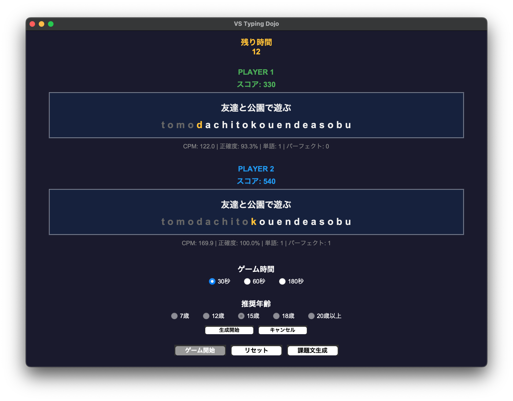

# VS Typing Dojo

プレーヤー 2 人で同じ課題文を同時に入力する対戦型タイピングゲームです。



勝敗は、入力ごとに加算されるスコアの合計で決まります。各課題文ごとにノーミスボーナスもあるため、勝利には速さだけでなく正確さも重要です。

課題文はプリセットされたものを使用する他、OpenAI API を使用した自動生成もできます。API key の発行は各自で実施してください。

## 起動までの流れ

### 事前準備

- Python 3.7 以上のインストール
- 外付けキーボード 1 or 2 台
  - PLAYER2 として使用するキーボードのみ CapsLock を有効にしてください
- （任意）OpenAI API key の発行
  - 参考 URL: https://platform.openai.com/api-keys

### セットアップ

```bash
git clone https://github.com/coderdojo-iwata/vs-typing-dojo.git
cd vs-typing-dojo
pip install -r requirements.txt

# (任意) OpenAI API を使用して課題文を生成する場合
export OPENAI_API_KEY="your-api-key-here"
```

### ゲームの起動

以下のコマンドを実行するとデスクトップアプリケーションが起動します。

```bash
python vs_typing_dojo.py
```

## 遊び方

### 基本的な流れ

1. **ゲーム時間選択**: 30 秒、60 秒、180 秒から選択
2. **課題文生成**（OpenAI API 利用時）:
   - 「課題文生成」ボタンをクリック
   - 推奨年齢（7 歳〜20 歳以上）を選択
   - 「生成開始」で新しい課題文を取得
3. **ゲーム開始**: 「ゲーム開始」ボタンでカウントダウン開始
4. **タイピング**: 表示されたローマ字を入力
   - いずれかのプレイヤーが課題文を入力し終えた時点で、次の課題文に進む
5. **結果確認**: スコアの高い方が勝者

### スコア算出方法

- 10 点 / 文字
- 50 点 / 課題文
- 100 点 / 課題文ノーミス

## ライセンス

このプロジェクトは [MIT License](LICENSE) のもとで公開されています。
